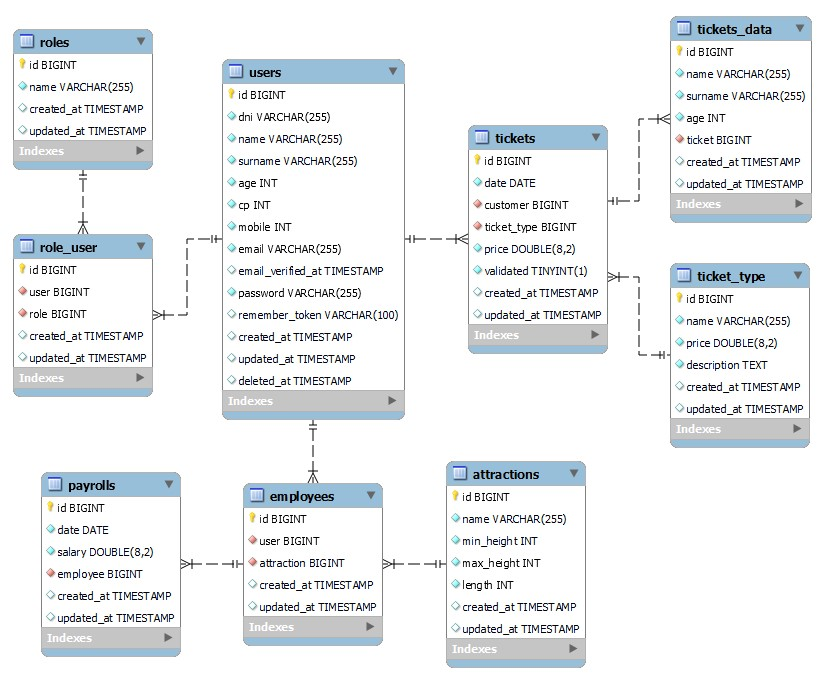

<h1 align="center">Proyecto final bootcamp Full Stack Developer</h1>
<h2 align="center">API para gestionar un parque temático ficticio</h2>
<details>
  <summary>Contenido 📝</summary>
  <ol>
    <li><a href="#objetivo">Objetivo</a></li>
    <li><a href="#sobre-el-proyecto">Sobre el proyecto</a></li>
    <li><a href="#diagrama-er">Diagrama Entidad Relación</a></li>
    <li><a href="#tecnologías-utilizadas">Stack - Tecnologías utilizadas</a></li>
    <li><a href="#instalación-en-local">Instalación en local</a></li>
    <li><a href="#endpoints">Endpoints</a></li>
    <li><a href="#contribuciones">Contribuciones</a></li>
    <li><a href="#agradecimientos">Agradecimientos</a></li>
    <li><a href="#contacto">Contacto</a></li>
    <li><a href="#licencia">Licencia</a></li>
  </ol>
</details>

## Objetivo
Este proyecto busca cubrir las necesidades de un parque temático inventado. Con esta API, puedes gestionar tanto las atracciones como las entradas al parque. Incluso en un futuro, se puede mejorar para llevar un control de los empleados que hay en el parque y sus nóminas. La base de datos está preparada para ello.

## Sobre el proyecto
Esta API ha sido desarrollada por **Héctor Mateu** como proyecto final del **Bootcamp:  Full Stack Developer** impartido por *Geekshubs Academy*. Se basa en el diseño del backend de un parque temático. El cuál es totalmente funcional y se le puede atacar mediante el <a href="https://github.com/hmateu/frontendFinalProjectReact.git">frontend</a> que también ha diseñado para esta aplicación.

## Diagrama ER


## Tecnologías utilizadas
    <a target="_blank" rel="noopener noreferrer nofollow" href="https://user-images.githubusercontent.com/121863208/227808620-cd6e5d5c-dd63-4a9d-b19d-0983807cae95.svg"></a> <a target="_blank" rel="noopener noreferrer nofollow" href="https://user-images.githubusercontent.com/121863208/227808612-8d3f0fee-99d9-45d8-8274-6584c9ac0b38.svg"></a> </a> <a target="_blank" rel="noopener noreferrer nofollow" href="https://camo.githubusercontent.com/3f0e26b0951bab845a1bb9a7198ecca0da272e462921b6edd85879f3673b6927/68747470733a2f2f696d672e736869656c64732e696f2f62616467652f506f73746d616e2d4646364333373f7374796c653d666f722d7468652d6261646765266c6f676f3d706f73746d616e266c6f676f436f6c6f723d7768697465"></a>

## Instalación en local
1. Clona el repositorio
`$ git clone https://github.com/hmateu/backendFinalProjectPhp.git`
2. Instala las dependencias
`$ npm install`
3. Crea el archivo .env para las variables de entorno
4. Crea la base de datos
5. Ejecuta las migraciones
`$ php artisan migrate`
6. Ejecuta los seeders
`$ php artisan db:seed`
7. Levanta el servicio de MySQL
**`En mi caso Docker`**
8. Levanta el servidor
`$ php artisan serve`

## Endpoints
A continuación se detallan los endpoints que han sido desarrollados en esta API para poder ser atacados desde un front. Desde Postman puedes verificar que funcionan correctamente ya que antes de utilizarlos en el front, se han validado con el propio Postman.
<details>
<summary>Endpoints</summary>

- **auth**
    - **/register**

            POST http://localhost:8000/api/auth/register
        body:
        ``` js
            {
                "dni": "35471123Z",
                "name": "Héctor",
                "surname": "Mateu Ortolá",
                "age": "29",
                "cp": 14336,
                "mobile": 630174559,
                "email": "hmateu.ortola@gmail.com",
                "password": "Hector1234!"
            }
        ```
    - **/login**

            POST http://localhost:8000/api/auth/login
        body:
        ``` js
            {
                "email":"hmateu.ortola@gmail.com",
                "password":"Hector1234!"
            }
        ```
    - **/profile** : Recupera los datos de tu perfil  

            GET http://localhost:8000/api/auth/profile

    - **/profile-update** : Modifica los datos que quieras de tu perfil. Los que no quieras cambiar elimínalos de la petición

            PUT http://localhost:8000/api/auth/profile-update

        body:
        ``` js
            {
                "dni": "35471123Z",
                "name": "Héctor",
                "surname": "Mateu Ortolá",
                "age": "29",
                "cp": 14336,
                "mobile": 630174559,
                "email": "hmateu.ortola@gmail.com",
                "password": "Hector1234!"
            }
        ```

    - **/logout** : Cierra sesión (debes estar logueado)

            POST http://localhostt:8000/api/auth/logout


- **atracciones**
    - **/attractions** : Recupera todas las atracciones  

            GET http://localhost:8000/api/attractions

    - **/attractions-admin** : Recupera todas las atracciones y los usuarios asignados a cada una (debes estar logueado como admin)  

            GET http://localhost:8000/api/attractions-admin

    - **/attraction/{id}** : Recupera la atracción con el id que le pases por argumento  

            GET http://localhost:8000/api/attraction/2

- **entradas**
    - **/new-ticket** : Genera una entrada nueva (debes estar logueado)  

            POST http://localhost:8000/api/new-ticket
        body:
        ``` js
            {
                "date": "2023-07-11",
                "ticket_type": 1
            }
        ```

    - **/my-tickets** : Recupera mis entradas (debes estar logueado)  

            GET http://localhost:8000/api/my-tickets

    - **/tickets** : Recupera todas las entradas (debes estar logueado como admin)  

            GET http://localhost:8000/api/tickets

    - **/ticket/{id}** : Elimina cualquier entrada (debes estar logueado como admin)  

            DELETE http://localhost:8000/api/ticket/4

- **Usuarios**

    - **/users** : Recupera todos los usuarios de la base de datos (debes estar logueado como admin)  

            GET http://localhost:8000/api/users

    - **/user/{id}** : Elimina cualquier usuario (debes estar logueado como admin)  

            DELETE http://localhost:8000/api/user/3

</details>

## Contribuciones
Las sugerencias y aportaciones son siempre bienvenidas.  

Puedes hacerlo de dos maneras:

1. Abriendo una issue
2. Crea un fork del repositorio
    - Crea una nueva rama  
        ```
        $ git checkout -b feature/nombreUsuario-mejora
        ```
    - Haz un commit con tus cambios 
        ```
        $ git commit -m 'feat: mejora X cosa'
        ```
    - Haz push a la rama 
        ```
        $ git push origin feature/nombreUsuario-mejora
        ```
    - Abre una solicitud de Pull Request

## Agradecimientos
Agradezco a mis profesores el tiempo dedicado a este proyecto y a mis compañeros por sus consejos y apoyo. Sin esta ayuda no lo hubiera conseguido en el tiempo estipulado.

- **Dani**  
<a href="https://github.com/Datata" target="_blank"></a> 

- **David**  
<a href="https://github.com/Dave86dev" target="_blank"></a>

- **Mara**  
<a href="https://github.com/MaraScampini" target="_blank"></a>

- **Jose**  
<a href="https://github.com/JoseMarin" target="_blank"></a>

## Contacto
<a href = "mailto:hmateu.ortola@gmail.com"></a> <a href="https://www.linkedin.com/in/h%C3%A9ctor-mateu-ortol%C3%A1-278b92160/" target="_blank"></a> 
## Licencia
Este proyecto se ha realizado bajo la **licencia MIT**.